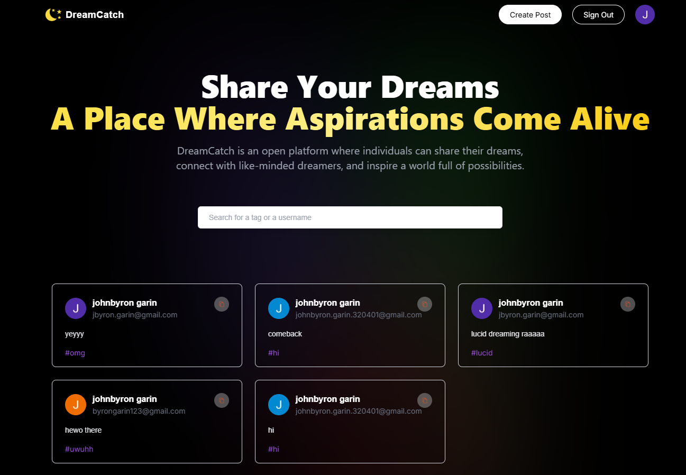
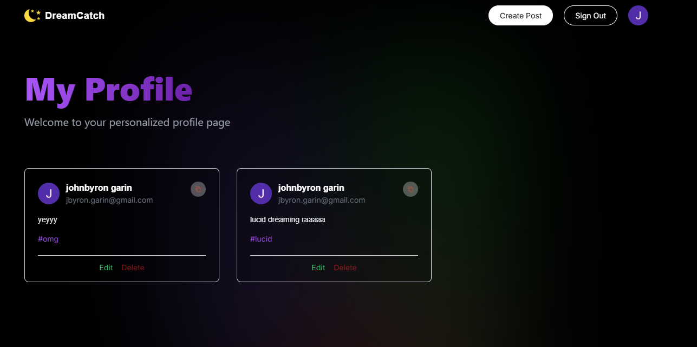
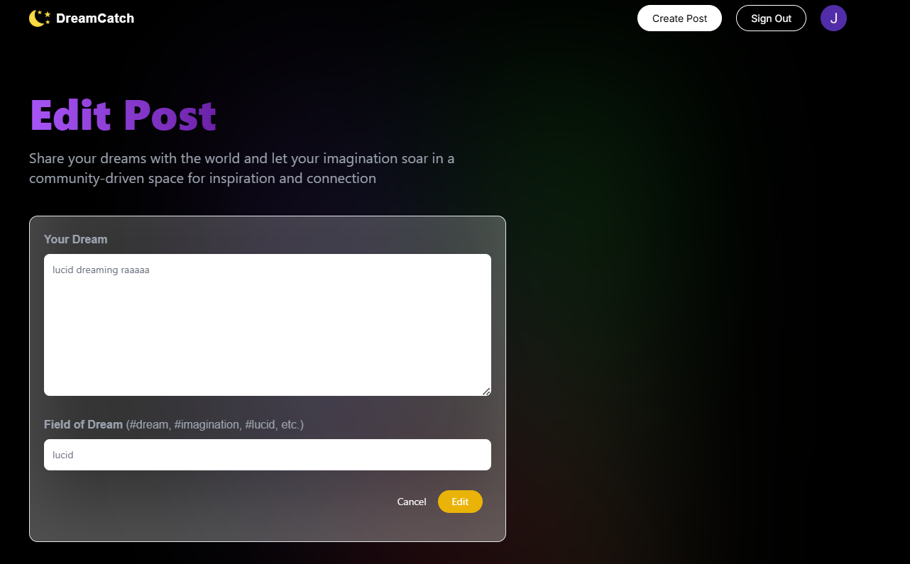

# Hello! Welcome to my first deployed web application.

This is a [Next.js](https://nextjs.org/) project bootstrapped with [`create-next-app`](https://github.com/vercel/next.js/tree/canary/packages/create-next-app).

## About the Project

This project was created as part of my learning journey to explore and understand the [Next.js](https://nextjs.org/) framework for web development. It serves as an opportunity to:

- **Deepen my knowledge of Next.js**: By working on this project, I learned more about its features, such as server-side rendering (SSR), static site generation (SSG), and routing.
- **Refresh my skills in web development**: This project allowed me to revisit and strengthen my skills in both frontend and backend development, reinforcing concepts such as component-based design, API integration, and responsive UI.
- **Learn website deployment**: I explored how to deploy a web application using [Vercel](https://vercel.com/), a platform that offers free and easy deployment solutions for Next.js projects.

## Trying it in the Deployed Web App

Using this public link, you can access the functionalities of the deployed web application:

[DreamCatch](https://my-first-deployed-web-app-self.vercel.app/)

## Features

- Built using the Next.js framework for optimal performance and modern web standards.
- Fully responsive design, ensuring compatibility across various devices.
- Deployed on [Vercel](https://vercel.com/), offering a fast and reliable hosting experience.

## Screenshots

Here are some screenshots of the application to give you a preview of its features and design:

1. **Main Page**  
   

2. **Create Post Section**  
   

3. **User Profile Section**  
   

4. **Edit Post Section**  
   

## References

- [Next.js Tutorial](https://www.youtube.com/watch?v=wm5gMKuwSYk&ab_channel=JavaScriptMastery)
- [Vercel Platform](https://vercel.com/new?utm_medium=default-template&filter=next.js&utm_source=create-next-app&utm_campaign=create-next-app-readme)

This project represents the beginning of my journey into building, deploying, and sharing web applications. I am excited to continue exploring the endless possibilities of web development!
